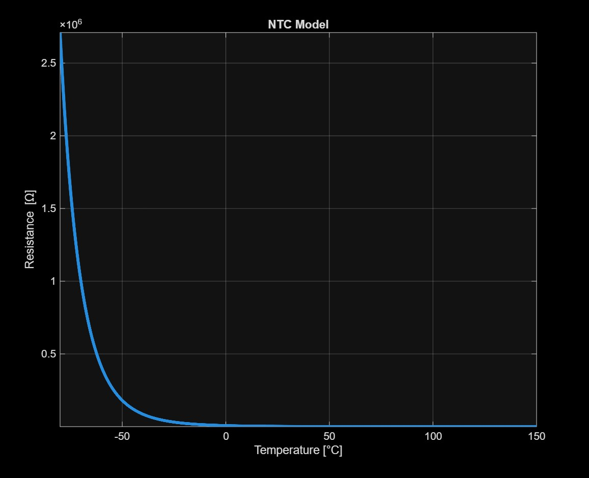
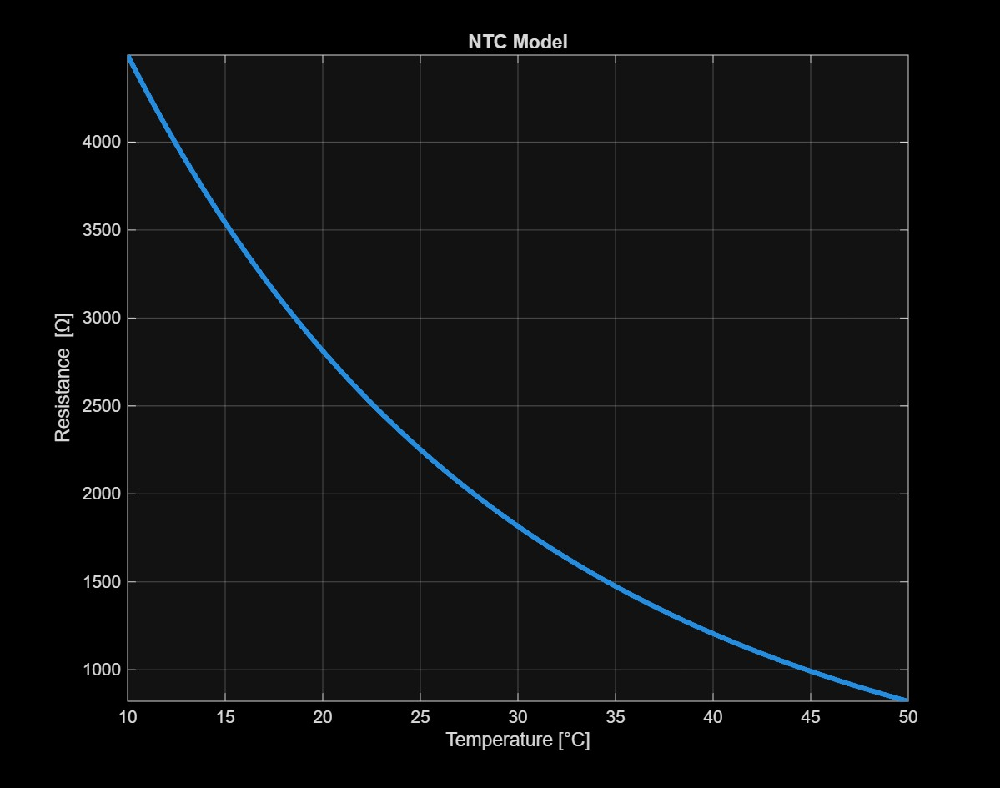
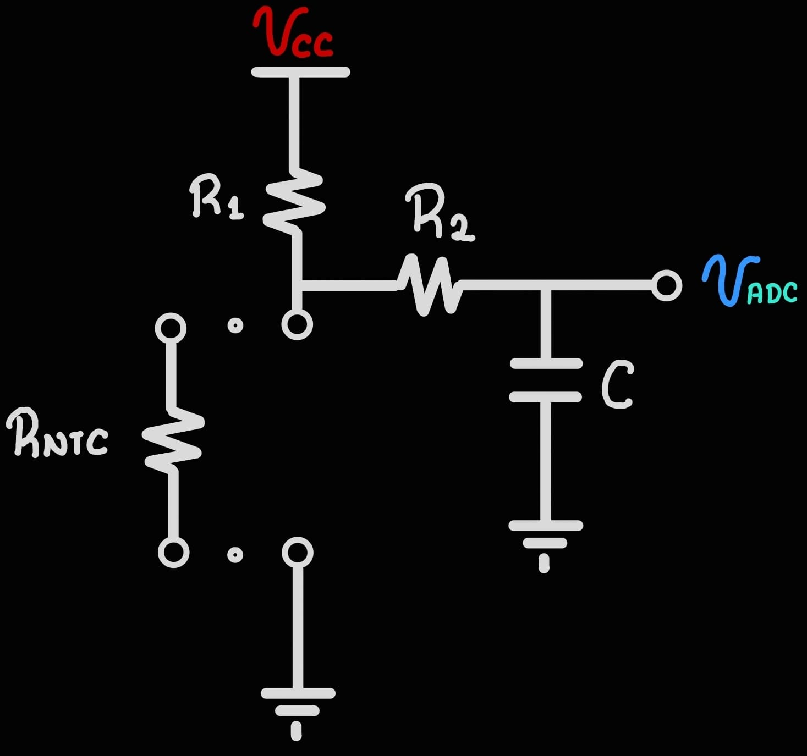
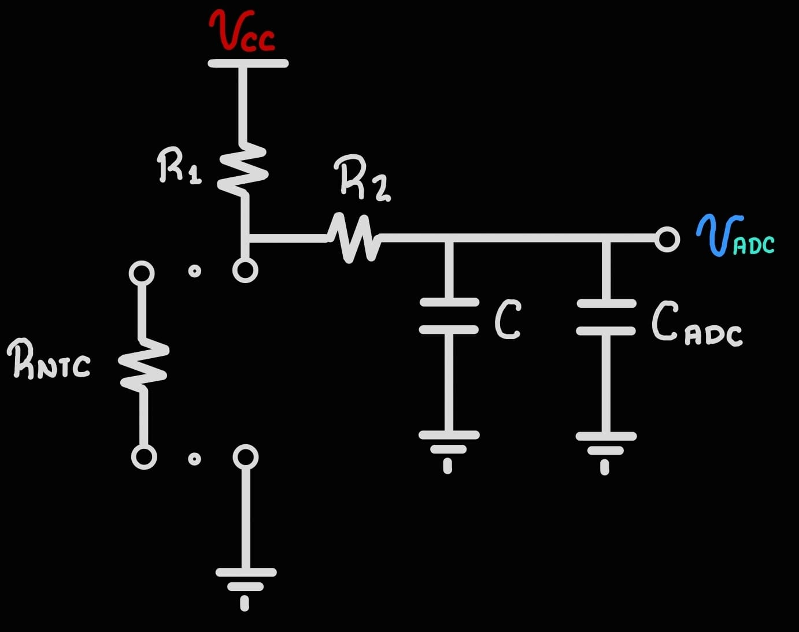
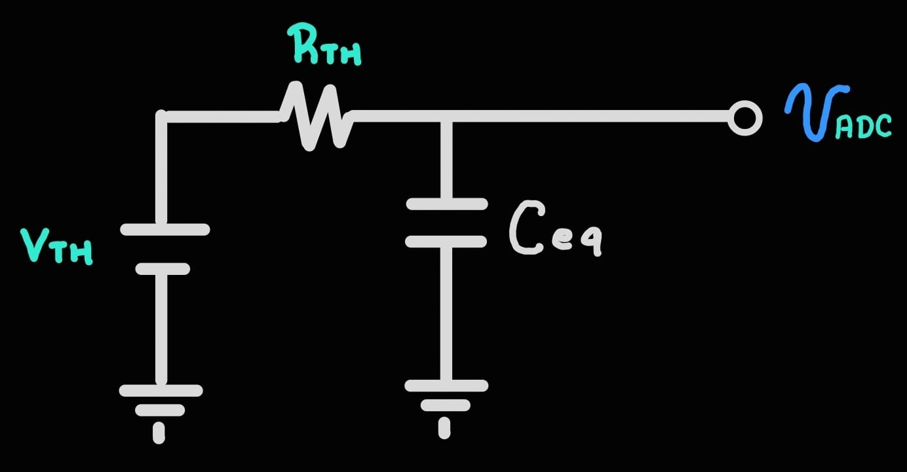
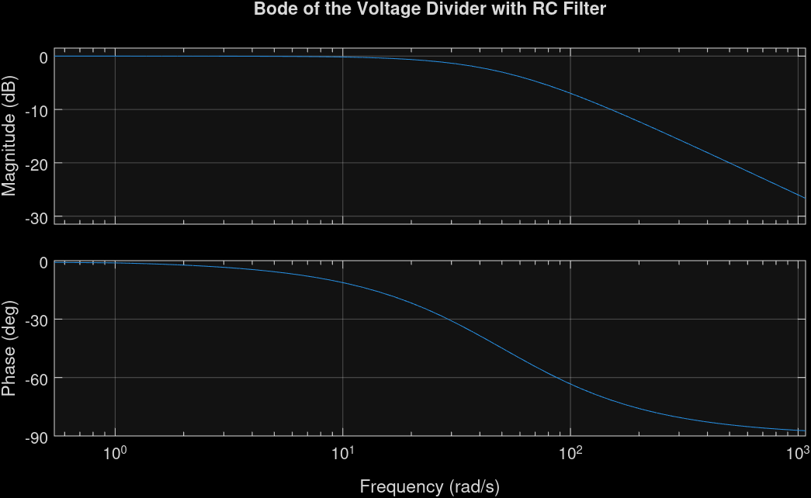

# Temperature Sensor
The Vital Signs Monitor uses a temperature sensor which measures rectal and skin temperature.
General Electric, Mindray and Welch Allyn use a 2.252 kΩ NTC sensor at 25°C.

## NTC Sensor
Negative Temperature Coefficient Thermistor (NTC) is a type of temperature-sensitive resistor where <b>the resistance decreases as the temperature increases</b>.

### PS222J2 NTC Sensor
 PS222J2 is a NTC sensor which has following specifications:

* Resistance at 25 °C: 2.252 kΩ 
* Resistance tolerance: ± 0.1 °C
* B0/50: 3890 K
* Operating Temperature: -80 °C ~ 150 °C
* Power-Max: 30 mW

The resistance–temperature relationship:

$$
R(T) = R_{25} \cdot e^{B(\frac{1}{T}-\frac{1}{T_{25}})} 
$$

       <figcaption><b>Figure 1:</b> NTC thermistor resistance–temperature model.</figcaption>

 
This design considers a range of 10 °C to 50 °C, so it uses a resistance of 820.73 Ω to 4.495 kΩ

       <figcaption><b>Figure 2:</b> NTC thermistor resistance–temperature model.   (Range of 10 °C to 50 °C).</figcaption>

 

More Information: \
[Datasheet PS222J2](https://www.littelfuse.com/assetdocs/littelfuse-leaded-thermistors-standard-precision-ps-datasheet?assetguid=f2c5cde0-806d-4632-bdd3-5e56183e2fd4)

## Hardware Designs
I plan to design three different circuits, each with distinct components, cost, and noise tolerance.

Therefore, it is also necessary to review the characteristics of the RP2040 ADC.

### SAR ADC in the RP2040
The SAR ADC has the following features:
* The ADC has 12 bits of resolution.
* Capturing a samples takes 96 clocks cycles.
* The ADC input has a capacitance of approximately 1 pF.

More Information: \
[Datasheet RP2040](https://datasheets.raspberrypi.com/rp2040/rp2040-datasheet.pdf)

### Voltage Divider with RC Filter
This Circuit is the simplest and the lowest-cost and the following figure shows the circuit used to measure the NTC sensor.

       <figcaption><b>Figure 3:</b> NTC Circuit.</figcaption>

$$
    V_{ADC} = \frac{R_{NTC}}{R_{NTC} + R_1} V_{CC}
$$

Now, we include the ADC input Capacitance and we obtain Thevenin equivalent Circuit:

        <figcaption><b>Figure 4:</b> NTC Circuit with Input ADC Capacitance.</figcaption>

 

$$
    V_{TH} = \frac{R_{NTC}}{R_{NTC} + R_1} V_{CC}; \quad R_{TH} = \frac{R_1 R_{NTC}}{ R_1 + R_{NTC} } + R_2;  \quad C_{eq} = C + C_{ADC}
$$

The following Circuit (Thevenin Circuit) is an RC Circuit, so the capacitance will charge to 63.2% in one time constant τ.

For 63.2 % $\quad \rightarrow  \quad τ = R_{TH} \cdot C_{eq}$

For 99 % $\quad \rightarrow  \quad 5τ = 5 R_{TH} \cdot C_{eq}$

       <figcaption><b>Figure 5:</b> Thevenin Circuit.</figcaption>

 

The RP2040 measures NTC sensor every 100 ms (10 Hz). Supose the  NTC has a resistance of 1.816 kΩ, so $R_1$ is chosen as 1.82 kΩ (at 10 °C) with a 1% tolerance. Additionaly, C is chosen as 10 μF. Therefore, we calculate the values ​​of the circuit elements:

$$
    5 \tau = 100 \text{ [ms]} \quad \rightarrow \quad \tau = 20 \text{ [ms]}; \quad \quad 
    C_{eq} \approx 10 \text{ [μF];} \\ \text{ at 10 °C} \quad \rightarrow \quad  R_{NTC} = 4.4951 \text{ [kΩ]}
 $$

$$
    R_2 = \frac{\tau}{C_{eq}} - \frac{R_1 R_{NTC}}{ R_1 + R_{NTC} } = 704.5174 \text{ [Ω]} \approx 698 \text{ [Ω]}
$$

As shown, the NTC value at 10°C is used because it is the highest resistance within the 10°C to 50°C range.

Now, we obtain the Frequency Response of the circuit:

$$
    H(j\omega) = \frac{1}{j\omega R_{TH} C_{eq}}
$$

       <figcaption><b>Figure 6:</b> Bode Diagram.</figcaption>

### Voltage Divider with Sallen-Key Filter

# References
1. Raspberry Pi Ltd. (2025). RP2040 datasheet: A microcontroller by Raspberry Pi [PDF]. https://datasheets.raspberrypi.com/rp2040/rp2040-datasheet.pdf
2. Littelfuse, Inc. (2025). PS222J2 leaded thermistor – standard precision PS series [Datasheet]. https://www.littelfuse.com/products/sensors/temperature-sensors/ntc-discrete-sensors/standard-precision-ps/ps222j2